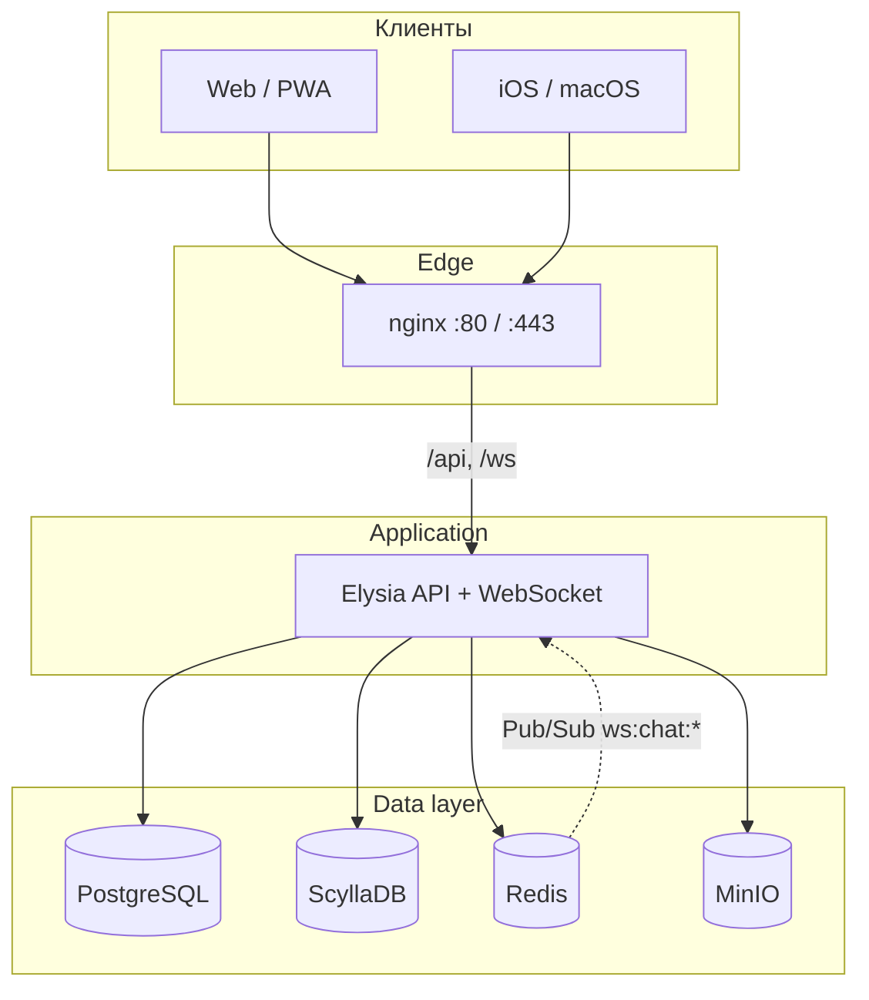

# Watermelon Messenger

**Real-time мессенджер** с личными и групповыми чатами, медиа, голосовыми и видеокружками.
Production: [watermelon-messenger.ru](https://watermelon-messenger.ru)

---
## Содержание

- [О проекте](#о-проекте)
- [Возможности](#возможности)
- [Стек](#стек)
- [Архитектура](#архитектура)
- [Быстрый старт](#быстрый-старт)
- [Конфигурация](#конфигурация)
- [Деплой](#деплой)
- [Безопасность](#безопасность)
- [Yandex OAuth](#yandex-oauth)
- [Структура репозитория](#структура-репозитория)
- [Разработка](#разработка)

---

## О проекте

Watermelon Messenger — self-hosted мессенджер в духе Telegram: мгновенная доставка через WebSocket, история в ScyllaDB, пользователи и чаты в PostgreSQL. Вход только через [Yandex ID](https://oauth.yandex.ru/). Есть веб-клиент (React), API на Bun и заготовки native-приложений (SwiftUI).

Монорепозиторий: `apps/api`, `apps/web`, общие типы в `packages/shared`. Native-клиенты — в отдельных репозиториях: [watermelon-ios](https://github.com/Pwatermelon/watermelon-ios), [watermelon-android](https://github.com/Pwatermelon/watermelon-android).

---

## Возможности

| Категория | Что есть |
|-----------|----------|
| **Чаты** | Личные диалоги, группы (в т.ч. пустые при создании), контакты |
| **Сообщения** | Текст, фото, файлы, голосовые, видеокружки |
| **Действия** | Удаление и пересылка сообщений, режим выбора как в Telegram |
| **Медиа** | Приватное хранилище (MinIO / S3), выдача по подписанным URL |
| **Профиль** | Аватар, обложка, био, галерея до 12 фото |
| **Коины** | Подарок за добровольную поддержку проекта → [melon-payment](../melon-payment) |
| **Клиент** | Тёмная / светлая тема, Web Push, PWA (service worker) |
| **Админка** | Панель для beta-доступа и модерации |

---

## Стек

| Слой | Технологии |
|------|------------|
| **API** | [Bun](https://bun.sh), [Elysia](https://elysiajs.com), WebSocket |
| **Web** | React 18, Vite, TypeScript |
| **Native** | SwiftUI (iOS / macOS scaffold) |
| **Реляционные данные** | PostgreSQL, [Drizzle ORM](https://orm.drizzle.team) |
| **Сообщения** | ScyllaDB (append-only лента) |
| **Кэш / Pub-Sub** | Redis (presence, rate limits, WS-рассылка) |
| **Медиа** | MinIO (S3-совместимое API) |
| **Инфра** | Docker Compose, nginx, Let's Encrypt (certbot) |
| **CI/CD** | GitHub Actions → Docker Hub → SSH deploy |

---

## Архитектура



**Поток сообщения:** клиент отправляет `message` по WebSocket → API пишет в ScyllaDB → публикует событие в Redis `ws:chat:{chatId}` → все инстансы API доставляют подписчикам чата.

**Медиа:** загрузка через `POST /upload` → объект в MinIO → метаданные в PostgreSQL → скачивание только через `GET /api/media/:file?access=…` (краткоживущий токен, проверка прав).

**Сеть в production:** наружу открыт только **web** (80/443). Postgres, Redis, Scylla и MinIO живут во внутренней docker-сети.

---

## Быстрый старт

### Требования

- [Docker](https://docs.docker.com/get-docker/) и Docker Compose v2
- или [Bun](https://bun.sh) ≥ 1.1 для локальной разработки

### Полный стек в Docker

```bash
git clone https://github.com/plwatermelon/watermelon-messenger.git
cd watermelon-messenger
docker compose up -d --build
```

Откройте **http://localhost:8080** — единственный порт, проброшенный наружу.

Внутри поднимаются: API, web, PostgreSQL, Redis, Scylla, MinIO.

### Локальная разработка (hot reload)

```bash
# Инфраструктура в фоне
docker compose up -d postgres redis scylla minio minio-init

# API и фронт на хосте
bun install
cp apps/api/.env.example apps/api/.env   # настройте Yandex OAuth
bun run dev
```

- API: `http://localhost:3000`
- Web (Vite): `http://localhost:5173`

Для API на хосте без MinIO задайте `MEDIA_STORAGE=local` в `apps/api/.env`.

---

## Конфигурация

Шаблоны переменных окружения:

| Файл | Назначение |
|------|------------|
| [`deploy/.env.example`](deploy/.env.example) | Production / `PROD_ENV_FILE` |
| [`apps/api/.env.example`](apps/api/.env.example) | Локальный API |

### Обязательно для production

```env
# База и секреты
POSTGRES_PASSWORD=
JWT_SECRET=
MESSAGE_AT_REST_KEY=

# Yandex OAuth
YANDEX_CLIENT_ID=
YANDEX_CLIENT_SECRET=
YANDEX_REDIRECT_URI=https://watermelon-messenger.ru/api/auth/yandex/callback
WEB_URL=https://watermelon-messenger.ru
API_PUBLIC_URL=https://watermelon-messenger.ru/api

# TLS (certbot)
CERTBOT_EMAIL=

# MinIO — медиафайлы
MINIO_ROOT_USER=
MINIO_ROOT_PASSWORD=
S3_BUCKET=watermelon-media
```
### Опционально

| Переменные | Назначение |
|------------|------------|
| `MELON_PAYMENT_URL`, `MELON_PAYMENT_API_KEY`, `MELON_PAYMENT_WEBHOOK_SECRET` | Учёт коинов через [melon-payment](../melon-payment) |
| `DONATION_ALERTS_URL` | Ссылка на страницу поддержки проекта в настройках |
| `VAPID_PUBLIC_KEY`, `VAPID_PRIVATE_KEY` | Уведомления в браузере (Web Push; не email). `npx web-push generate-vapid-keys` |
| `ADMIN_YANDEX_LOGINS`, `ADMIN_YANDEX_IDS` | Доступ в админ-панель |

`MESSAGE_AT_REST_KEY` — base64 ≥ 32 байт или произвольная строка (будет нормализована). Шифрует content и metadata сообщений в ScyllaDB (AES-256-GCM).

---

## Деплой

Релизы запускаются **только** коммитом с semver в первой строке сообщения:

```bash
git commit -m "ver 1.0.12"
git push origin main
```

Pipeline: unit-тесты → сборка образов → push в Docker Hub → rsync конфигов на VPS → `deploy-server.sh`.

**GitHub Secrets:** `DOCKERHUB_TOKEN`, `PROD_ENV_FILE`, `DEPLOY_SSH_HOST`, `DEPLOY_SSH_USER`, `DEPLOY_SSH_KEY`, `DEPLOY_PATH`.

Образы: `plwatermelon/watermelon-messenger-api:X.Y.Z`, `plwatermelon/watermelon-messenger-web:X.Y.Z`.

Подробная инструкция: **[deploy/DEPLOY.md](deploy/DEPLOY.md)** — первичная настройка сервера, TLS, MinIO, rollback, бэкапы.

```bash
# Ручной деплой на сервере
WM_VERSION=1.0.12 ./scripts/deploy-server.sh
```

---

## Безопасность

| Слой | Реализация |
|------|------------|
| Транспорт | HTTPS, WSS |
| Аутентификация | Yandex OAuth 2.0 → JWT (30 дней) |
| Сообщения at-rest | AES-256-GCM (`MESSAGE_AT_REST_KEY`) |
| Медиа | Приватный бакет; публичный `/uploads` отключён |
| API | Rate limits (Redis): 300 req/min глобально, 30/min auth, 20 uploads/min |

Это **не** client-side E2E: сервер расшифровывает сообщения для доставки и поиска, как в типичных мессенджерах с server-side encryption.

---

## Yandex OAuth

1. Создайте приложение на [oauth.yandex.ru](https://oauth.yandex.ru/) (платформы **Веб** и при необходимости **iOS/macOS**).

2. Redirect URI:

   | Окружение | Redirect URI |
   |-----------|--------------|
   | Dev (Docker) | `http://localhost:8080/api/auth/yandex/callback` |
   | Production | `https://watermelon-messenger.ru/api/auth/yandex/callback` |
   | Native | `watermelon://oauth/yandex` |

3. Иконка для Yandex OAuth: `apps/web/public/yandex-oauth-icon.png` (200×200, квадрат PNG).

4. Native (iOS / macOS): см. [YANDEX_OAUTH.md](https://github.com/Pwatermelon/watermelon-ios/blob/main/YANDEX_OAUTH.md) в репозитории watermelon-ios.

**API (основное):**

| Method | Path | Описание |
|--------|------|----------|
| GET | `/auth/yandex` | Redirect на Yandex (web) |
| GET | `/auth/yandex/callback` | Callback → JWT |
| GET | `/auth/yandex?platform=native` | URL авторизации для native |
| POST | `/auth/yandex/exchange` | Обмен code → JWT |

---

## Структура репозитория

```
watermelon-messenger/
├── apps/
│   ├── api/              # Bun + Elysia, REST, WebSocket, Drizzle
│   └── web/              # React + Vite, PWA
├── packages/
│   └── shared/           # Общие TypeScript-типы
├── deploy/               # docker-compose prod, nginx, .env.example
├── scripts/              # deploy-server.sh, backup, certbot
└── .github/workflows/    # release.yml
```

### Другие репозитории проекта

| Репозиторий | Назначение |
|-------------|------------|
| [watermelon-messenger](https://github.com/Pwatermelon/watermelon-messenger) | API, web, deploy (этот) |
| [watermelon-ios](https://github.com/Pwatermelon/watermelon-ios) | SwiftUI (iOS / macOS) |
| [watermelon-android](https://github.com/Pwatermelon/watermelon-android) | Android (заготовка) |
| [watermelon-infra](https://github.com/Pwatermelon/watermelon-infra) | Инфраструктура (будущий переезд в Yandex Cloud) |

---

## Разработка

### Команды

```bash
bun run dev          # API + web параллельно
bun run build        # production build
bun test             # unit-тесты API
bun run test:e2e     # Playwright (локально)
bun run db:migrate   # миграции PostgreSQL
bun run db:studio    # Drizzle Studio
```

### Health и метрики

| Endpoint | Описание |
|----------|----------|
| `GET /health` | Postgres + Redis |
| `GET /metrics` | Uptime, requests, memory |

### Бэкап PostgreSQL

```bash
./scripts/backup-postgres.sh
```

### Поддержка проекта и коины

**DonationAlerts:**

1. **`DA_SECRET_TOKEN`** в `.env` **melon-payment** — секретный токен виджета (тот же, что в OBS). По нему payment получает уведомления о поддержке.
2. **`DONATION_ALERTS_URL`** в `.env` **мессенджера** — ссылка на страницу поддержки для кнопки в настройках.

OAuth-приложение DonationAlerts **не нужно**. Коины начисляются как подарок за поддержку, не как покупка.

Подробнее: [melon-payment/README.md](../melon-payment/README.md).

---

## Ссылки

- Production: [watermelon-messenger.ru](https://watermelon-messenger.ru)
- Деплой: [deploy/DEPLOY.md](deploy/DEPLOY.md)
- Native OAuth: [watermelon-ios/YANDEX_OAUTH.md](https://github.com/Pwatermelon/watermelon-ios/blob/main/YANDEX_OAUTH.md)
